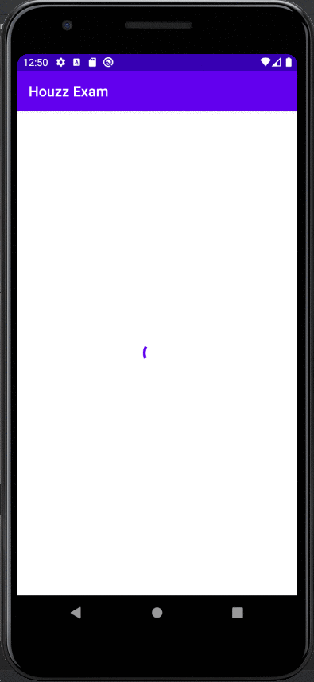

# ViewPager2Urls
Houzz MVVM arch web pages loader app

fetch list of url from the network and load each one of them in a seperate page inside viewpager2

* <b>Corutines</b> - Observer Pattern
* <b>Hilt</b> - Injection
* <b>Retrofit</b> - Network
* <b>ViewPager2</b> - View 

